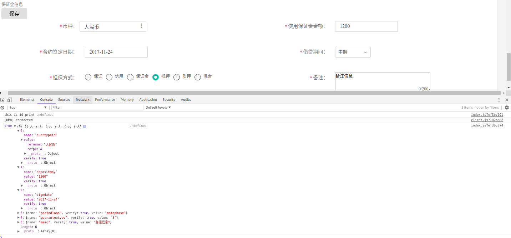

##　示例： 代码还需要完善一下 


###　要点：

1. Form 组件下　直接跟　FormItem FormItem 下只有一个元素
2. 通过设置 checkFormNow true | false　能控制回调　submitCallBack　的执行
3. 校验参考　[官网](https://github.com/tinper-bee/bee-form) 　自定义校验　在FormItem 写asyncCheck　函数　，FormItem 会传入对应表单的值给函数　　返回　true校验通过否则不通过

4.　下面给出　Input  Select Refer DatePick几种表单的例子　其他可以参考[api github](https://github.com/tinper-bee/bee-form) [tinper bee](http://bee.tinper.org/bee-form)
5. 有问题随时沟通


```javascript
import React, { Component } from 'react';
import { Panel, FormGroup, Navbar, Timeline, Label, Button, FormControl, Radio, InputGroup, Breadcrumb, PanelGroup, Con, Row, Col, Tree, Message,Switch, Icon, Table, Pagination } from 'tinper-bee';


import { CheckboxItem, RadioItem, TextAreaItem, ReferItem , SelectItem, InputItem, DateTimePickerItem} from 'containers/FormItems';

import DatePicker from 'bee-datepicker';
import zhCN from 'rc-calendar/lib/locale/zh_CN';
import moment from 'moment';
import Select from 'bee-select';

import  Form from 'bee-form';
import 'bee-form/build/Form.css';
const { FormItem } = Form;
const Option = Select.Option;
// const OptGroup = Select.OptGroup;
const format = 'YYYY-MM-DD HH:mm:ss';
const dateInputPlaceholder = '选择日期';


export default class Demo extends Component {
	constructor(props) {
		super(props);
		this.state = {
			currtypeid: {
	 			value: 4,
	 			display: '人民币',
	 			scale: -1
	 		},
			depositmny: {
				value: 1000,
				display: null,
				scale: -1
			},
			signdate: {
				value: '2017-11-11',
				display: null,
				scale: -1
			},
			periodunit: {
				value: 'QUARTER',
				display: null,
				scale: -1
			},
			guaranteetype: {
				value: '1',
				display: null,
				scale: -1
			},
			periodloan: {
				value: 'metaphase',
				display: null,
				scale: -1
			},
			memo: {
				value: '备注信息',
				display: null,
				scale: -1
			}, 
			checkForm: false;
		};
	}

	handleSubmit = (verify, data, others) =>{
 		console.log(verify, data, others);
 		this.state.checkForm = false;
 		this.setState();
 	}


	render() {

		let self = this;
		return (
			 <Panel>
				<div className="section-title"> 保证金信息</div>
				<Button onClick={()=> { this.state.checkForm　= true; this.setState();}}>保存</Button>
				<Form   useRow={true}  showSubmit={false} checkFormNow={ this.state.checkForm }
						submitCallBack={ this.handleSubmit }　>
                    <FormItem inline={ true} showMast={true} labelXs={2}  labelSm={2} labelMd={2} xs={4} md={4} sm={4} 
                    	labelName="币种："  method="change"  errorMessage="币种格式错误"  >
                    	<ReferItem name="currtypeid" defaultValue={{refname: this.state.currtypeid.display, refpk: this.state.currtypeid.value} }
                    	 refCode="currencyRef"	 refModelUrl="/bd/currencyRef/" /> 
                    </FormItem>
					<FormItem inline={ true } showMast={true} labelXs={2} labelSm={2} labelMd={2} xs={4} md={4} sm={4} 
						labelName="使用保证金金额："   isRequire={true}  errorMessage="请输入使用保证金金额" 
						method="change"  reg={/^[0-9]+$/}  >
						<InputItem name="depositmny" defaultValue={this.state.depositmny.value} placeholder="请输入使用保证金金额" />
                    </FormItem>

                    	<FormItem inline={ true } showMast={true} labelXs={2} labelSm={2} labelMd={2} xs={4} md={4} sm={4}  
                		labelName="合约签定日期：" isRequire={ true }  errorMessage="请输入申请日期" >
	                    <DateTimePickerItem  name="signdate"  format={ format } locale={ zhCN }
	                       defaultValue={ moment( this.state.signdate ) } placeholder={ dateInputPlaceholder }/>
	                </FormItem>
                    <FormItem inline={ true} showMast={true} labelXs={2}  labelSm={2} labelMd={2} xs={4} md={4} sm={4} 
                    	labelName="借贷期间："  isRequire={true} >
						<SelectItem name="periodloan"  defaultValue={this.state.periodloan.value} 
									items = {
										() => {
											return [{
												label: '短期',
												value: 'short'
											}, {
												label: '中期',
												value: 'metaphase'
											}, {
												label: '长期',
												value: 'long'
											}]
										}
									}

		 				 />
                    </FormItem>

                    <FormItem inline={ true} showMast={true} labelXs={2}  labelSm={2} labelMd={2} xs={4} md={4} sm={4} 
                    	labelName="担保方式："   >
		                <RadioItem  name="guaranteetype"
                    		defaultValue={ this.state.guaranteetype.value }
                    		items= {
                    			() => {
                    				return [{
                    					label: '保证',
                    					value: '0'
                    				}, 
                    				{
                    					label: '信用',
                    					value: '1'
                    				}, {
                    					label: '保证金',
                    					value: '2'
                    				}, {
                    					label: '抵押',
                    					value: '3'
                    				}, {
                    					label: '质押',
                    					value: '4'
                    				}, {
                    					label: '混合',
                    					value: '5'
                    				}
                    				]
                    			}
                    		}
                    	/>
                    </FormItem> 
                    <FormItem  inline={ true} showMast={true} labelXs={2}  labelSm={2} labelMd={2} xs={4} md={4} sm={4} 
                    	labelName="备注："  isRequire={true}   method="change" 
                    	errorMessage="备注格式错误"  >
					    <TextAreaItem   cols={50}  defaultValue={ this.state.memo.value }
					    		rows={3} count={ 200 } name="memo" />
					</FormItem> 

            	</Form>
			</Panel>
		);
	}
}

```

